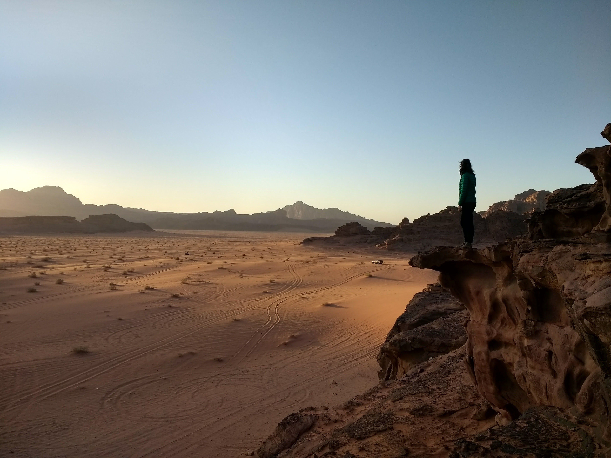
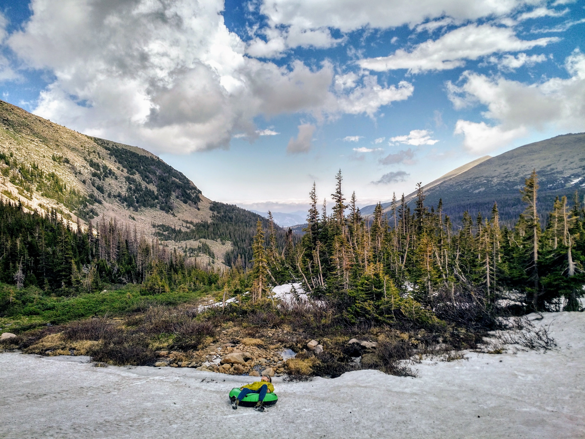

<link rel="stylesheet" href="styles.css" type="text/css">

[Google scholar](https://scholar.google.com/citations?user=n9ztAjgAAAAJ&hl=en).

**6)** **Blumstein, M.**, R. Hopkins. In Submission PC&E. Adaptive variation and plasticity in nonstructural carbohydrate storage in a temperate tree species. [Preprint on Authorea](https://www.authorea.com/doi/full/10.22541/au.160071423.34337856)

**5)** **Blumstein, M.**, A. Sala, D. Weston, N.M. Holbrook, R. Hopkins. In Submission. Trees actively allocate carbohydrates to storage. 

**4)** **Blumstein, M.**, A.D. Richardson, D. Weston, J. Zhang, W. Muchero, and R. Hopkins. 2020. STAR Protocols. [Protocol for projecting allele frequency change under future climate change at adaptive-associated loci.](https://www.sciencedirect.com/science/article/pii/S2666166720300484) 

**3)** **Blumstein, M.**, A.D. Richardson, D. Weston, J. Zhang, W. Muchero, and R. Hopkins. 2020. Current Biology. [A new perspective on ecological prediction reveals limits to climate adaptation in a temperate tree species.](https://www.sciencedirect.com/science/article/pii/S0960982220301743?casa_token=Hgt9PQP5O2QAAAAA:mnoWePTm9IvZIMSiSNoZGtZqxagjMJ289qefRxPfPIBAqgJbrtHbEzVOOQIJhOZaFgpi2PRJ) 

**2)** **Blumstein, M.** and J.R. Thompson. 2015 Journal of Applied Ecology. [Land use impacts on the quantity and configuration of ecosystem service provisioning in Massachusetts, USA.](https://besjournals.onlinelibrary.wiley.com/doi/epdf/10.1111/1365-2664.12444) 

**1)** Thompson J. R., K. Fallon-Lambert, D.R. Foster, E. Broadbent, **M. Blumstein**, A. Almeyda Zambrano, Y. Fan. 2016. Ecosphere. [The consequences of four plausible land-use scenarios for forest ecosystems and their services in Massachusetts, USA.](https://esajournals.onlinelibrary.wiley.com/doi/epdf/10.1002/ecs2.1469) 

