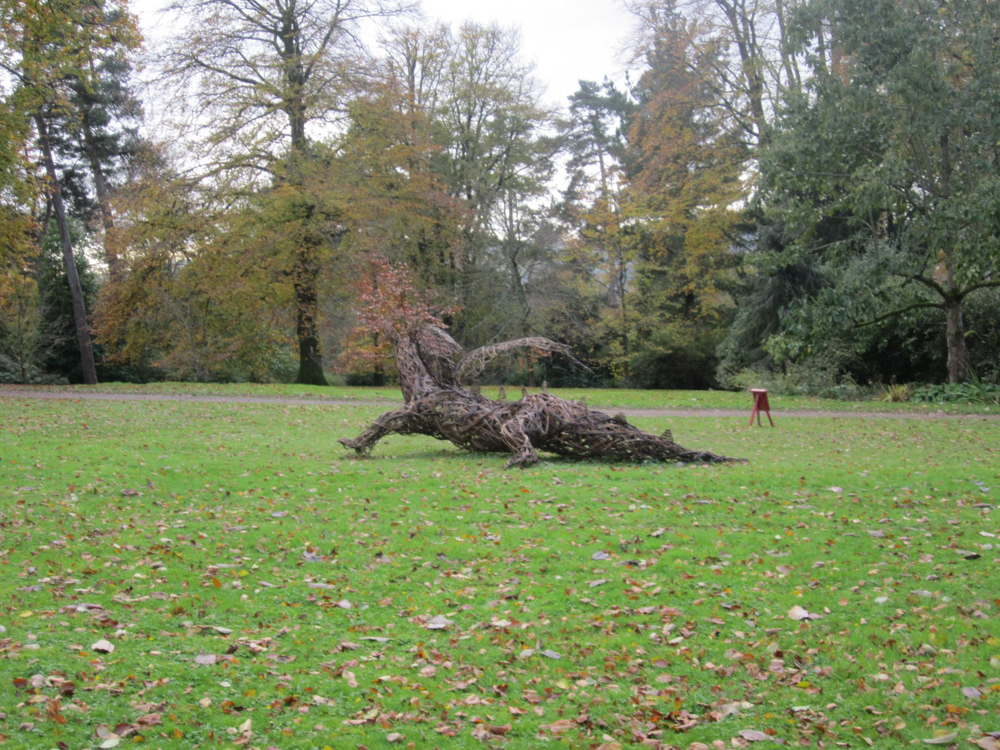

<link rel="stylesheet" href="styles.css" type="text/css">

[Google scholar](https://scholar.google.com/citations?user=n9ztAjgAAAAJ&hl=en).

**12)** **Blumstein, M.**, S. Webster, R. Hopkins, D. Basler and D.L. DesMarais. 2022. In Preparation BioRxiv. [Genomics highlight an underestimation of the urban heat island effect on red oak phenology (Q. rubra).](https://www.biorxiv.org/content/10.1101/2022.08.03.502691v1)

**11)** **Blumstein, M.**, M. Oseguera, T. Caso-McHugh, D.L. DesMaris. 2022. In Review. Twig nonstructural carbohydrate dynamics’ relationship to leaf development. 

**10)** **Blumstein, M.**, J. Gersony, J. Martinez-Vilalta, A. Sala. 2022. In Review. Global nonstructural carbohydrate variation with climate.

**9)** **Blumstein, M.**, A. Sala, D. Weston, N.M. Holbrook, R. Hopkins. 2022. New Phytologist. [Plant carbohydrate storage: intra- and inter-specific tradeoffs reveal a major life history trait.](https://nph.onlinelibrary.wiley.com/doi/epdf/10.1111/nph.18213) 

**8)** Rabideau-Childers, R., K. Angier, B. Dean, **M. Blumstein**, W. Darling, C. Ziemke, C. Perez-Martinez, D. Wu, W. Ye, I. Yekwayo, D. Kimuyu, D. Martins, N. Pierce. 2021. Ecology & Evolution. [Evidence of nutrient translocation in response to smoke exposure by the East African ant acacia, Vachellia drepanolobium.](https://onlinelibrary.wiley.com/doi/10.1002/ece3.8244) 

**7)** Barker Plotkin, A., **M. Blumstein**, D. Laflower, J. Chandler, J. Elkinton, J. Thompson. 2021. Functional Ecology.  [Defoliated trees die below a critical threshold of stored carbon.](https://besjournals.onlinelibrary.wiley.com/doi/abs/10.1111/1365-2435.13891) 

**6)** **Blumstein, M.** & M. Furze. 2021. Accepted. Nonstructural carbohydrate response of temperate forest trees to drought. 

**5)** **Blumstein, M.**, R. Hopkins. 2021. Plant, Cell, & Environment. [Adaptive variation and plasticity in nonstructural carbohydrate storage in a temperate tree species.](https://onlinelibrary.wiley.com/doi/abs/10.1111/pce.13959?af=R)

**4)** **Blumstein, M.**, A.D. Richardson, D. Weston, J. Zhang, W. Muchero, and R. Hopkins. 2020. STAR Protocols. [Protocol for projecting allele frequency change under future climate change at adaptive-associated loci.](https://www.sciencedirect.com/science/article/pii/S2666166720300484) 

**3)** **Blumstein, M.**, A.D. Richardson, D. Weston, J. Zhang, W. Muchero, and R. Hopkins. 2020. Current Biology. [A new perspective on ecological prediction reveals limits to climate adaptation in a temperate tree species.](https://www.sciencedirect.com/science/article/pii/S0960982220301743?casa_token=Hgt9PQP5O2QAAAAA:mnoWePTm9IvZIMSiSNoZGtZqxagjMJ289qefRxPfPIBAqgJbrtHbEzVOOQIJhOZaFgpi2PRJ) 

**2)** **Blumstein, M.** and J.R. Thompson. 2015 Journal of Applied Ecology. [Land use impacts on the quantity and configuration of ecosystem service provisioning in Massachusetts, USA.](https://besjournals.onlinelibrary.wiley.com/doi/epdf/10.1111/1365-2664.12444) 

**1)** Thompson J. R., K. Fallon-Lambert, D.R. Foster, E. Broadbent, **M. Blumstein**, A. Almeyda Zambrano, Y. Fan. 2016. Ecosphere. [The consequences of four plausible land-use scenarios for forest ecosystems and their services in Massachusetts, USA.](https://esajournals.onlinelibrary.wiley.com/doi/epdf/10.1002/ecs2.1469) 

