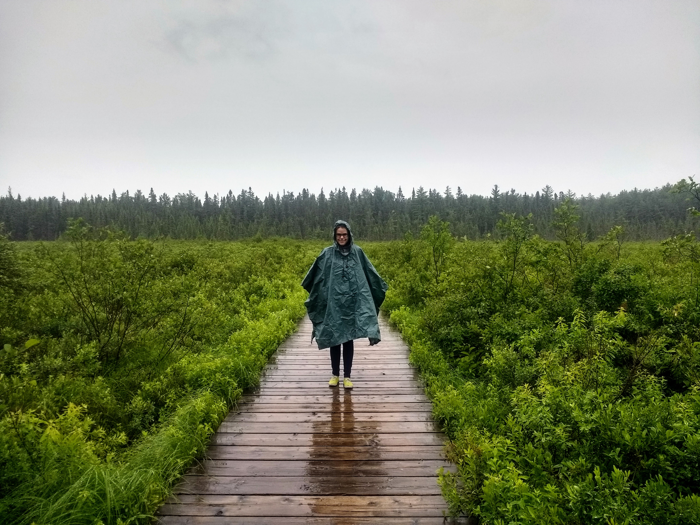

<link rel="stylesheet" href="styles.css" type="text/css">

 

## Motivation 

Trees are a vital stabilizing force for the climate and provide us with countless ecosystem services. Yet, forests are facing unprecedented levels of stress from pest and disease outbreaks, frequent and intense disturbance, fragmentation, and a changing climate. These stressors have already led to an increase of tree mortality events globally, altering forest composition from the regional scale to the cellular level. 

In response to stress, individual trees can plastically alter their traits within a generation, or species can migrate or adaptively evolve in order to persist. Given the extremity of predicted stress increases, all three will be critical for species survival. 

## Questions

**How will tree species respond to the next century of abiotic and biotic stress?**

**What are the key physiological traits that enable survival?**

**Can we help speed species response (eg. assisted migration, designing adaptive landscapes, etc)?**

## Approach 

Our lab takes an interdisciplinary approach to studying the relationships between phenotype, genotype, and environment in tree species. We aim to better understand the drivers of resilience to stress in tree species and their potential to respond to future change. We use a combination of **experimental** (eg. common gardens, growth chambers), **observational**, and **modeling** studies to both drill down to the genes and alleles influencing phenotypes and scale up to examine how patterns of climate, demography and local adaptation may influence future response to change. We utilize a broad range of tools from genomics and transcriptomics, to quantitative genetics, plant physiology, and spatially explicit modeling. 

