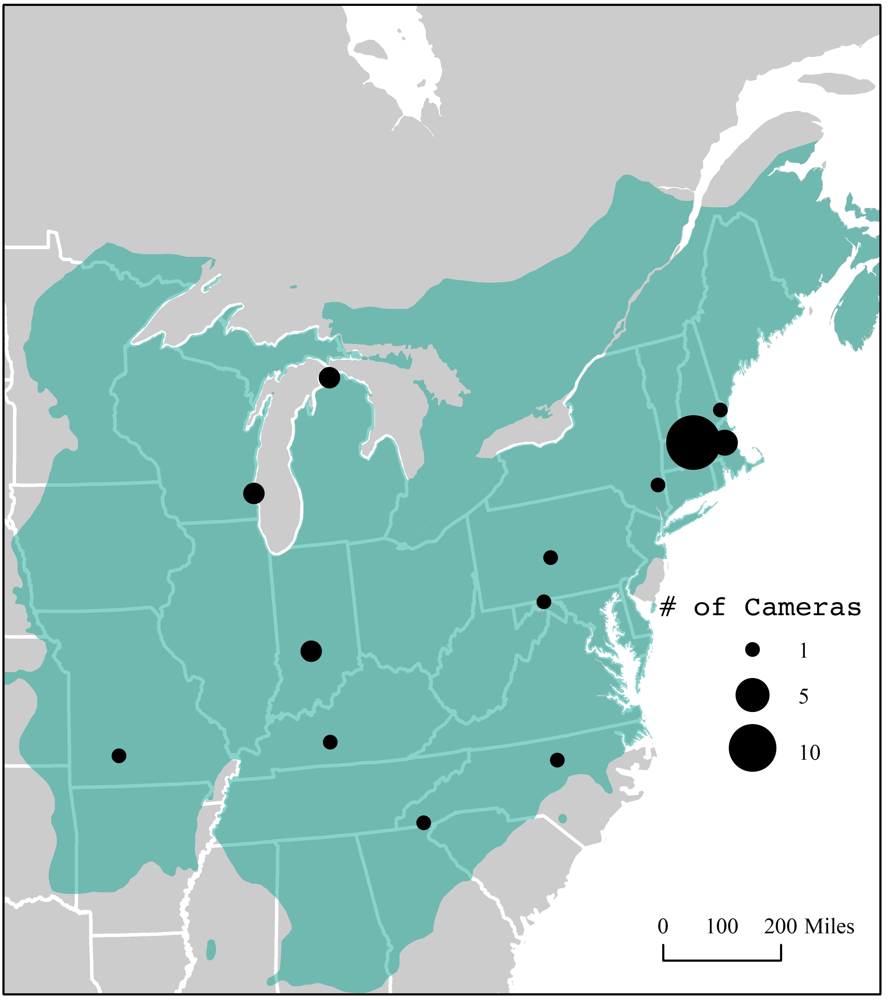
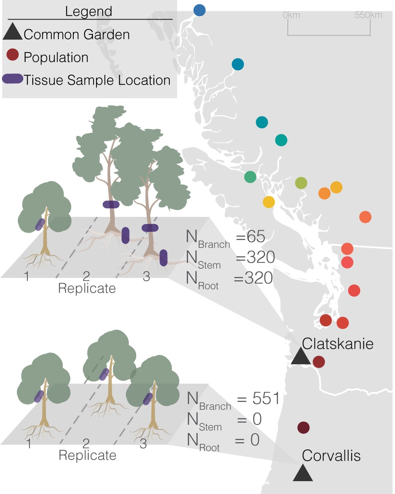
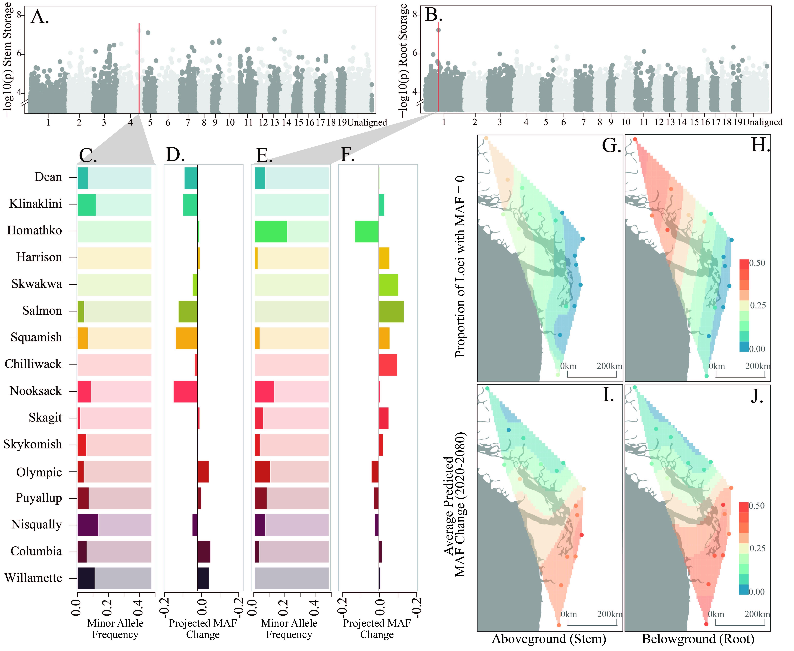

<link rel="stylesheet" href="styles.css" type="text/css">

 

## Overview

Forests provide us with countless ecosystem services, yet today are facing unprecedented levels of stress; pest and disease outbreaks, frequent and intense disturbance, fragmentation and development, and a warming climate. **A central challenge for understanding how forests will fare in the long-term is how to link processes occurring at the cellular level to those occurring across the whole forest.** 

To date, researchers have focused on how environment drives variation in plant phenotypes, or sets of observable traits. However, these efforts have often uncovered conflicting patterns across scales of biological organization, making it difficult to identify emergent properties, or rules, that would aid prediction. This is partly because phenotypes are the product of an individual’s genes (G), environment (E), and the interaction between the two (GxE). Thus, past efforts have almost completely ignored how genetics also impact phenotypic variation. 

This oversight is particularly problematic as the genetic component of phenotypic variation is not insignificant. Many traits that enable adaptation are also highly heritable, meaning much of the variation measured at a site can be attributed to genetics, and there is a growing recognition that genotype-by-environment interactions are pervasive, indicating that individuals may frequently respond differently and non-linearly to environmental cues based on their genetic composition. 

This large gap in our understanding of what forms plants’ phenotypes motivates my interdisciplinary research program. I utilize tools from plant ecophysiology, population and functional genomics, and mechanistic modeling to generate insights about phenotypic variation (G, E, GxE) in forest ecosystems, and scale patterns from the gene to ecosystem. 
 

## Study Systems

* Black Cottonwood (Populus trichocarpa) : a fast-growing riverine species, native to the pacific northwest. It is the first model genomic species for tree research. I work in transplanted gardens in Oregon, maintained by the Department of Energy. All 1000+ cottowood genotypes located in the garden are clonally replicated and have full genome sequences available via the JGI phytozome website. 

* Red Oak (Quercus rubra) : a dominant forest species across eastern North America, red oak is emerging as a new model system for population genomics research in trees. 

## Untangling the environmental and genetic drivers of phenological timing in red oak to improve predictions

[NSF PRFB Award](https://www.nsf.gov/awardsearch/showAward?AWD_ID=2010781&HistoricalAwards=false)

Forests absorb a large proportion of carbon emissions each year via photosynthesis, making them a key player in mitigating global change. Thus, knowing when trees start and end photosynthesis each year is essential to predicting future warming. Extensive research has shown that the timing of leaf-out in trees is governed by both genetics and environment. However, no study to date has combined our understanding of these two drivers and their interaction into one framework. This study will address this need by elucidating how environment and genetics interact to alter leaf-out timing in the North American species red oak (Quercus rubra). Broader impacts include broadening participation of students from underrepresented groups and the generation of new genomic and phenotypic resources that will improve the ability to predict leaf-out timing and provide guidance for setting up assisted migration conservation programs aimed to speed the movement of locally adapted individuals northward in pace with environmental change. Training objectives for the Fellow include genomics, gene expression profiling, ecophysiology, and process-based modeling.

This project will leverage a wide-spread system of phenological cameras (phenocams) in a novel way to quantify the genetic and environmental drivers of leaf-out variation in red oak and integrate this into a process-based model. Specific objectives include: 1) genetically sequencing red oak individuals growing in phenocam "viewsheds". These sequences will be used to derive population structure and develop a set of candidate loci associated with phenological timing; 2) experimentally manipulating twigs collected after budset from a subset of individuals to parse out the environmental versus genetic drivers of variation; 3) collecting gene expression data via transcriptomics to further refine candidate loci; and, 4) modifying existing process-based model structures to test hypotheses regarding how the inclusion of population structure, genetic variation, and local adaptation can improve model performance and alter our predictions. [In Progress]

## Genetic & Environmental Drivers of Variation in Nonstructural Carbohydrate Storage

   
The storage of nonstructural carbohydrates is a trait that has been hypothesized to provide trees with long-term resilience to extremes. Nonstructural carbohydrates are the sugars, primarily glucose, fructose, and sucrose, and starch that are produced by trees during photosynthesis that are not immediately used for growth or reproduction, but rather are stored in the ray and parenchyma cells of a tree’s woody tissues (branch, stem, roots). Like an animal’s fat stores, these labile sugars and starch represent the total energetic stores of the tree and serve as a vital buffer for plants in stressful times when demand (growth, defense, metabolism, etc.) exceeds current photosynthetic supply, such as during the dormant season or in response to environmental stress/disturbance. 
  

**1) Combined ecophysiology and predictive climate modeling with analyses of genomic variation to determine if sugar and starch storage, energy reserves for trees under extreme conditions, have the heritable variation and genetic diversity necessary to evolve in response to climate change** within populations of black cottonwood (Populus trichocarpa). Despite current patterns of local adaptation, and extensive range-wide heritable variation in storage, we demonstrate that adaptive evolution in response to climate change will be limited by a lack of heritable variation within northern populations and by a need for extreme genetic changes in southern populations.  Our method can help design more targeted species management interventions and highlights the power of using genomic tools in ecological prediction to scale from molecular to regional processes to determine the ability of a species to respond to future climates. [Published]

<figure>
  
  <figcaption>From [Blumstein et al. 2020](https://www.sciencedirect.com/science/article/pii/S0960982220301743?casa_token=Hgt9PQP5O2QAAAAA:mnoWePTm9IvZIMSiSNoZGtZqxagjMJ289qefRxPfPIBAqgJbrtHbEzVOOQIJhOZaFgpi2PRJ) Genome-wide analysis (GWAS) results for (A) aboveground and (B) belowground total NSC storage. The minor allele frequency (MAF) for the most significant loci in each GWAS (highlighted via a red line) are plotted for each population and 1,060 genomes (C&E), with the plots directly adjacent (D&F) showing the predicted change in MAF over the next 60 years due to climate change (IPCC A1B scenario). The top row of maps illustrate the proportion of loci associated with (G) aboveground and (H) belowground NSC storage that entirely lack the minor allele altogether (eg. Plot C & Plot E, population Skwakwa), with warm colors lacking heritable variation. The bottom row of maps illustrates the average amount of absolute MAF change predicted under future climate scenarios with warmer colors requiring greater allele frequency shifts. Related to Table S1 and Figures S2 and S4.  .</figcaption>
</figure>

**1) Are NSC storages actively stored?** This project finally establishes that trees do have the innate, genetic capacity to regulate the amount they allocate to storage and can pass this ability onto their offspring. This finding alters our understanding of carbon allocation in trees and ultimately affects our predictions of forests’ ability to absorb carbon dioxide emissions into the future. [In Review]

<!-- <figure> -->
<!--     
<!--   src="images/Ch2_Fig2.png"> -->
<!--   <figcaption>For nonstructural carbohydrate (NSC) reserve formation to be considered an active process, NSC storage accumulation must exhibit (1) genetic variation and (2) NSC stores must tradeoff of with other carbon sinks (negative correlation in variance). Here we demonstrate how (A) relationships between carbon sink values measured in the field may be (B) formed in a number of different ways, thus complicating our ability to draw conclusions about active versus passive storage unless both (C) genetic variation is measured and (D) relativized for differences in individual productivity .</figcaption> -->
<!-- </figure> -->

**1) E and GxE in NSC storage** - Trees’ total amount of nonstructural carbohydrate (NSC) stores and the proportion of these stores residing as insoluble starch are vital traits for individuals living in variable environments. However, our understanding of how stores vary in response to environmental stress is poorly understood as the genetic component of storage is rarely accounted for in studies. Here, we quantified variation in NSC traits in branch samples taken from over 600 clonally transplanted black cottonwood (Populus trichocarpa) trees grown in two common gardens. We found heritable variation in both total NSC stores and the proportion of stores in starch (H2TNC = 0.19, H2PropStarch = 0.31), indicating a substantial genetic component of variation. In addition, we found high amounts of plasticity in both traits in response to cold temperatures and significant genotype-by-environment (GxE) interactions in the total amount of NSC stored (54% of P is GxE). This finding of high GxE indicates extensive variation across trees in their response to environment, which may explain why previous studies of carbohydrate stores’ responses to stress have failed to converge on a consistent pattern. Overall, we found high amounts of environmental and genetic variation in NSC storage concentrations, which may bolster species against future climate change. [In Review]

<!-- <figure> -->
<!--   
<!--   src="images/Ch3_Fig4.jpg"> -->

<!--   <figcaption> Plasticity between the two common gardens in the two traits measured, (A) total NSC stores (TNC) and (B) the proportion of TNC in starch. Black lines represent the average value across all genotypes, with error bars indicating one standard deviation from the mean. The other lines are colored by latitude and each line represents a genotype, where genotype values were estimated using equation (1).</figcaption> -->

<!-- </figure> -->

<!--   -->
<!--   -->
<!--   -->
<!--   -->

**1)NSC legacy response to drought** - Storage of nonstructural carbohydrates (NSCs) by plants may serve as a potential resiliency mechanism to drought, yet we know little about how NSCs respond under natural drought conditions. Here, we quantified in situ NSC responses of temperate forest trees to the 2016 drought in the northeastern United States. Sugar and starch concentrations were measured annually in the stemwood of five tree species from 2014-2019, which allowed us to monitor NSCs in relation to climatic conditions before, during, and following the natural drought. We found that immediately following drought, measured NSC concentrations decreased. However, NSC concentrations rebounded quickly within three years. Notably, trees allocated proportionally more to starch than to sugars following the 2016 drought. In winter 2017, starch comprised 45% of total stores, whereas starch made up only 1-2% in other years. Variation in total NSC concentrations was significantly predicted by the previous year’s temperature, with concentrations decreasing following hotter periods and increasing following cooler periods. Overall, our work provides insight into the climatic drivers of NSC storage and highlights the important role that starch metabolism may play in the regulation of C dynamics and plant resiliency during drought stress. [In Submission]

**1)How insect defoliation drove oak trees to carbon starvation in MA** - measure NSC levels across a natural experimental gradient of intensity and frequency of gypsy moth defoliation in MA [In prep]

