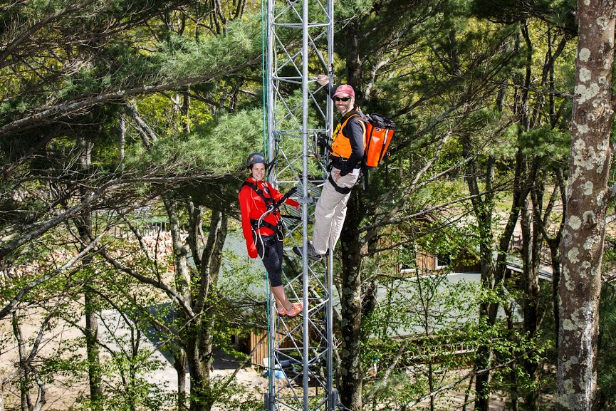
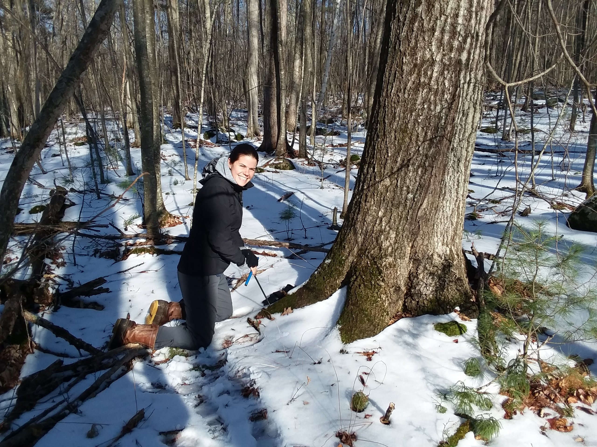
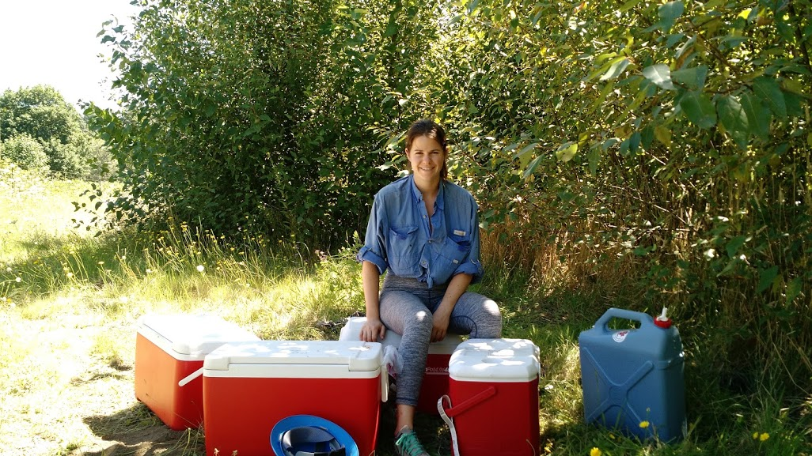

<link rel="stylesheet" href="styles.css" type="text/css">

 

## How will forest species survive ongoing climate change?

I am interested in predicting the degree to which species and populations have the ability to adapt to rapid climate change. To do so, I identify the phenotypic traits that enable local adaptation, then parse the degree to which these traits are driven by genetic differences (nature) or the environment in which the plant resides (nurture). Finally, I explore the adaptive potential of a species or population by integrating the environmental and genetic components of key traits into predictive models. I use methodologies from plant physiology, ecology, genomics, and modeling to achieve this goal.   

**Study Systems**

* Black Cottonwood (Populus trichocarpa) : a fast-growing riverine species, native to the pacific northwest. It is the first model genomic species for tree research. I work in transplanted gardens in Oregon, maintained by the Department of Energy. All 1000+ cottowood genotypes located in the garden are clonally replicated and have full genome sequences available via the JGI phytozome website. 

* Red Oak (Quercus rubra) : a dominant forest species across eastern North America, red oak is emerging as a new model system for population genomics research in trees. 

**Identify the phenotypic traits that enable adaptation**

* Nonstructural Carbohydrate Storage -

* Leaf-out and senescence phenological timing - 

**Environmental Contribution to Phenotype**

* Carbohydrate storage variation in relation to drought and pest outbreak in red oak

* Environmental plasticity and GxE in carbohydrate storage in black cottonwood

**Genetic Contribution to Phenotype**

* Genetic controls on nonstructural carbohydrate storage

* Population structure of red oaks and the genes associated with phenological timing

**Assessing Adaptive Potential**

* Using allele-frequency associations with climate to predict adaptive potential of populations of black cottonwood

* Integrating the genetic and environmental drivers of leaf timing into a process-based model

