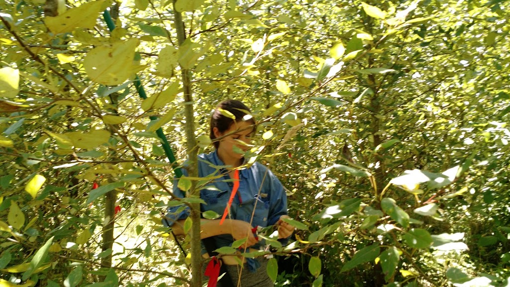
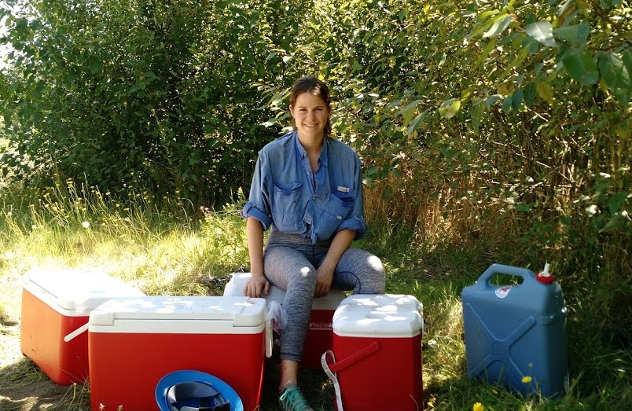
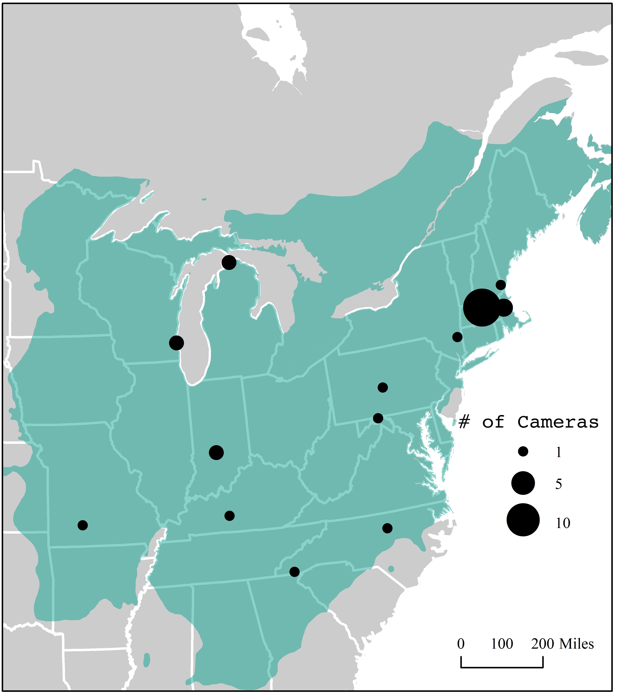

<link rel="stylesheet" href="styles.css" type="text/css">

 

## Overview

Forests provide us with countless ecosystem services, yet today are facing unprecedented levels of stress; pest and disease outbreaks, frequent and intense disturbance, fragmentation and development, and a changing climate. These selective agents act to alter forest composition from the regional scale (species ranges') to the cellular level (allele frequencies). Thus, a central challenge for understanding how forests will be impacted by future change is how to integrate across scales of plant biology.

Phenotypes, or sets of observable traits, are the product of an individual’s genes (G), environment (E), and the interaction between the two (GxE). Researchers have detailed how environment (E) drives variation in tree phenotypes over long time periods (eg. LTER studies) and across large special scales (eg. Flux Network). In parallel, researchers have discovered the genes and pathways that govern phenotypes, finding high heritability (G) and signatures of local adaptation in many plant life history traits. However, these fields remain largely independent of each other to date, weakening our ability to accurately predict forest response to change. 

**My research program bridges the gap between molecular and ecological plant research to create a unified understanding of forest tree response to change.** I take an interdisciplinary approach by combining new sequence data with large-scale networks of phenotypic data collection and environmental records to ask questions about local adaptation and the evolutionary potential of forest tree populations. 

## Ongoing

[NSF PRFB Award](https://www.nsf.gov/awardsearch/showAward?AWD_ID=2010781&HistoricalAwards=false)

Forests absorb a large proportion of carbon emissions each year via photosynthesis, making them a key player in mitigating global change. Thus, knowing when trees start and end photosynthesis each year is essential to predicting future warming. Extensive research has shown that the timing of leaf-out in trees is governed by both genetics and environment. However, no study to date has combined our understanding of these two drivers and their interaction into one framework. This study will address this need by elucidating how environment and genetics interact to alter leaf-out timing in the North American species red oak (Quercus rubra). Broader impacts include broadening participation of students from underrepresented groups and the generation of new genomic and phenotypic resources that will improve the ability to predict leaf-out timing and provide guidance for setting up assisted migration conservation programs aimed to speed the movement of locally adapted individuals northward in pace with environmental change. Training objectives for the Fellow include genomics, gene expression profiling, ecophysiology, and process-based modeling.

This project will leverage a wide-spread system of phenological cameras (phenocams) in a novel way to quantify the genetic and environmental drivers of leaf-out variation in red oak and integrate this into a process-based model. Specific objectives include: 1) genetically sequencing red oak individuals growing in phenocam "viewsheds". These sequences will be used to derive population structure and develop a set of candidate loci associated with phenological timing; 2) experimentally manipulating twigs collected after budset from a subset of individuals to parse out the environmental versus genetic drivers of variation; 3) collecting gene expression data via transcriptomics to further refine candidate loci; and, 4) modifying existing process-based model structures to test hypotheses regarding how the inclusion of population structure, genetic variation, and local adaptation can improve model performance and alter our predictions. [In Progress]

