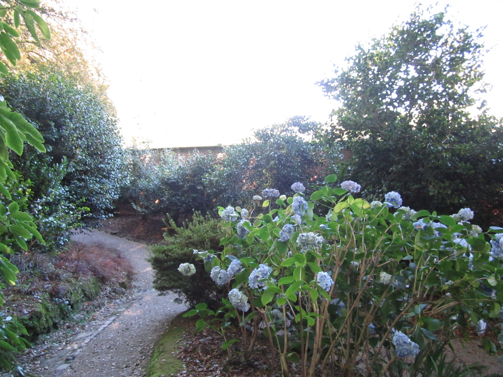

  
<link rel="stylesheet" href="styles.css" type="text/css">
    
```{r setup, include=FALSE}
  knitr::opts_chunk$set(echo = TRUE)
  library(fontawesome)
```
  
```{css, echo=FALSE}
  
.info-tile {
  height: 30vw;
  width: 91vw;
  max-width: 900px;
  max-height: 300px;
  background: #ffffff;
  display: flex;
  text-overflow: ellipsis;
  overflow: hidden;
  word-wrap: break-word;
  line-height: 5vw;
  font-size: 5vw;
  color: white;
  font-weight: bold;
  position: relative;
  margin:0.1%
}
  
.info-tile:hover {
opacity:0.5;
}

.info-tile-large-text {
display: float;
padding-left: 1vw;
margin-top: 2.5vw;
margin-bottom:4vw;
font-size: 75%;
}

.info-tile-small-text {
display: inline-block;
font-size: 40%;
padding-left: 1vw;
}

.info-tile-img {
position: float;
left: 52%;
top: 15%;
opacity: .4;
height: 10vw;
font-size:10vw;
}

/* At large media widths */
@media screen and (min-width: 1000px) {
  .info-tile {
    font-size: 50px;
    line-height: 65px;
  }
  
  .info-tile-large-text {
    display: inline-block;
    padding-left: 10px;
    margin-top: 25px;
    margin-bottom: 20px;
  }
  
  .info-tile-small-text {
    display: inline-block;
    font-size: 40%;
    padding-left: 10px;
  }
  
  .info-tile-img{
    position: absolute;
    left: 52%;
    top: 15%;
    //opacity: .4;
    height: 100px;
    font-size: 100px;
  }
}

.info-tile2 {
height: 30vw;
width: 30vw;
max-width: 300px;
max-height: 300px;
background: #ffffff;
  display: inline-block;
text-overflow: ellipsis;
overflow: hidden;
word-wrap: break-word;
line-height: 5vw;
font-size: 5vw;
color: white;
font-weight: bold;
position: relative;
margin:0.1%
}

.info-tile2:hover {
opacity:0.5;
}


/* At large media widths */
@media screen and (min-width: 1000px) {
  .info-tile2 {
    font-size: 50px;
    line-height: 65px;
  }
  
  .info-tile2-large-text {
    display: inline-block;
    padding-left: 10px;
    margin-top: 25px;
    margin-bottom: 20px;
  }
  
  .info-tile2-small-text {
    display: inline-block;
    font-size: 40%;
    padding-left: 10px;
  }
  
  .info-tile2-img{
    position: float;
    left: 52%;
    top: 15%;
    //opacity: .4;
    height: 100px;
    font-size: 100px;
  }
}

<style>

a:link {
  color: white;
  background-color: transparent;
  text-decoration: none;
}

a:visited {
  color: #FFBC67;
  background-color: transparent;
  text-decoration: none;
}

a:hover {
  color: white;
  background-color: transparent;
  text-decoration: underline;
}

a:active {
  color: white;
  background-color: transparent;
  text-decoration: underline;
}
</style>

```


<div>

<div class="info-tile" id="tile1" style = "background: #455C7B;">
<!-- <div class="info-tile" id="tile1" style = "background-image: url('images/web_3.jpg');"> -->
<span class = "info-tile-large-text">About</span> <br />
<a href="about.html" class="link">
  
  </a>
</div>


<div class="info-tile2" id="tile2" style = "background: #685C99;">
<span class = "info-tile-large-text">People</span> <br />
<a href="people.html" class="link">
  
  </a>
</div>


<div class="info-tile2" id="tile3" style = "background: #AC6C99;">
<span class = "info-tile-large-text">Publications</span> <br />
<a href="Publications.html" class="link">
  
  </a>
</div>

<div class="info-tile2" id="tile4" style = "background: #DA727E;">
<span class = "info-tile-large-text">Opportunities</span> <br />
<a href="opportunities.html" class="link">
  
  </a>
</div>

<div class="info-tile" id="tile5" style = "background: #FFBC67;">
<span class = "info-tile-large-text">Current Projects</span> <br />
<a href="current_projects.html" class="link">
  
  </a>
</div>


</div>


