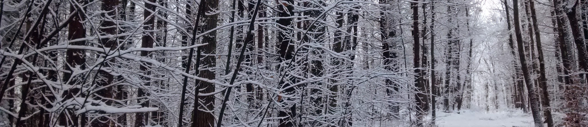
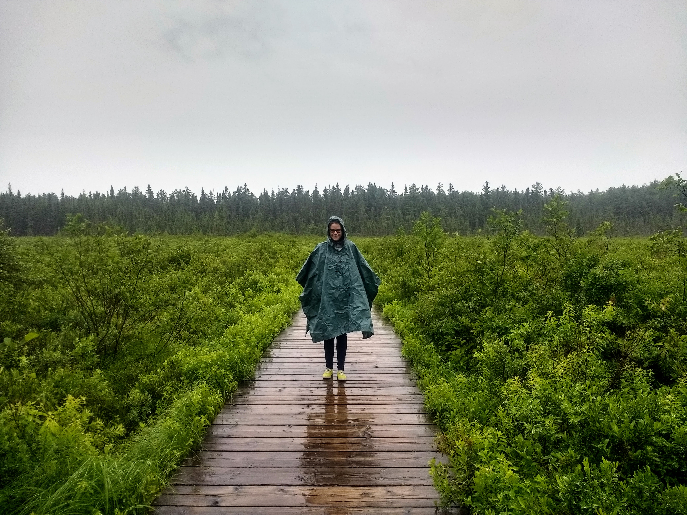

<link rel="stylesheet" href="styles.css" type="text/css">

 

I am an NSF Postdoctoral Fellow interested in understanding how temperate trees will survive predicted climate change. I use a combination of plant ecophysiology, population genetics, functional genomics, and predictive modeling to explore the degree to which species will experience mortality, exhibit plasticity, or undergo local adaptive evolution in response to environmental change. 

My current fellowship project is advised by David DesMarais at [MIT](https://cee.mit.edu/people_individual/david-des-marais/) and Isabelle Chuine at the [Center for Functional Ecology and Evolution (CEFE)](https://www.cefe.cnrs.fr/fr/recherche/ef/dream/829-c/132-isabelle-chuine). The work seeks to unite our understanding of the environmental and genetic drivers of variation in phenological timing into a unified, process-based model. 

 

