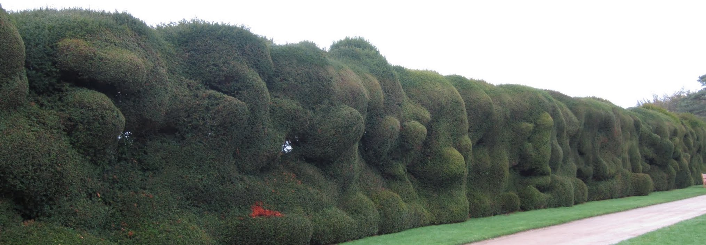
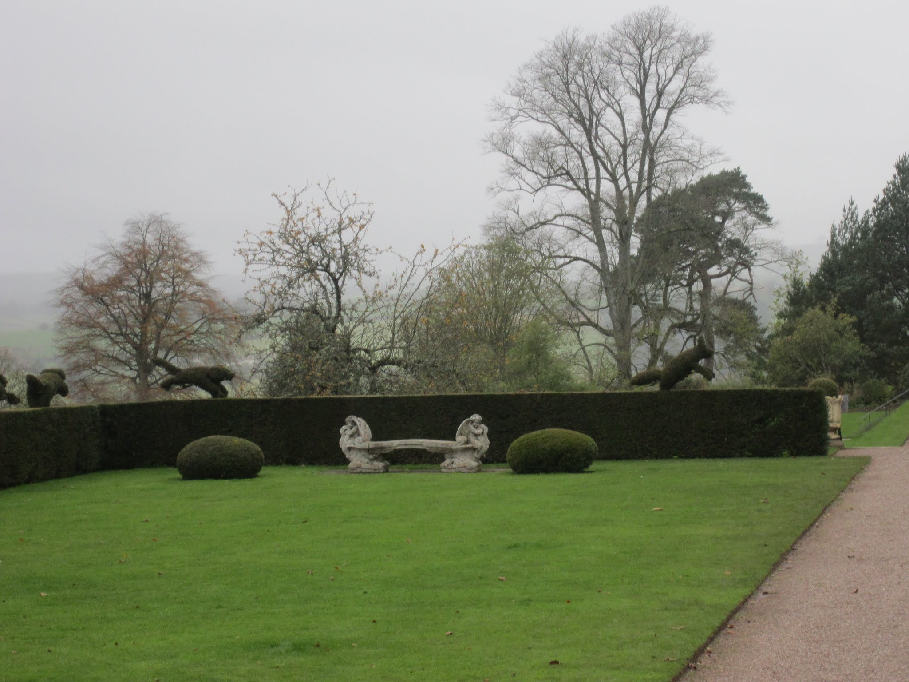

<link rel="stylesheet" href="styles.css" type="text/css">

 

## The consequences of four landuse scenarios to ecosystem service provisioning in Massachusetts 

Ecosystem services are the multitude of benefits that humans derive from their natural environment. These include tangible uses like food and lumber and more intangible benefits like nutrient cycling and water filtration. More recently, ecosystem services have been highlighted as a tool for evaluating the merit of proposed development projects or of conserving parcels of land. 

In 2013 and 2014 I worked as a research assistant on a large NSF funded project that brought together stakeholders from across Massachusetts to evaluate how landuse decisions being made today might affect the state over the next several decades. I specifically parameteriezed, calibrated, validated, and evaluated the multitude of forestry and ecosystem service models used to quantify the impacts that expansion of agriculture and development have on service provisioning. 

The project employed stakeholders throughout the process, from conceptualization to development and delivery. This group included land trust managers, state legislators, and environmental state officials. Our work resulted in [two](https://esajournals.onlinelibrary.wiley.com/doi/epdf/10.1002/ecs2.1469) [publications](https://besjournals.onlinelibrary.wiley.com/doi/epdf/10.1111/1365-2664.12444) and a [white report](https://harvardforest.fas.harvard.edu/sites/default/files/Changes%20to%20the%20Land%20-%20final%20report%20-%20Jan%202014.pdf)  that was circulated amongst stakeholders. It has informed zoning reform policy in the state and is still being used by groups like the Nature Conservancy today as an evaluation tool. 

{width=800px;height=1000px}

 

## Combatting invasive pest and disease in British gardens 

Invasive pests and diseases (p&d) cause massive economic damage each year to the agricultural, timber, and ornamental plant industries. The introduction of these p&d's has increased exponentially over the past several decades with the increase of trade between nations, causing issues worldwide. 

My role at the [National Trust](https://www.nationaltrust.org.uk/) as a Damaris Horan Prize Fellow was to assess the current challenges facing gardeners in NT system today in regards to controlling pest and disease outbreaks in their gardens. I met with gardeners at properties across Cornwall and Devon to learn about the on-the-ground challenges they face, attended conferences with [DEFRA](https://www.gov.uk/government/organisations/department-for-environment-food-rural-affairs),  [Forestry Commision](https://www.gov.uk/government/organisations/forestry-commission), and [Kew Garden](https://www.kew.org/kew-gardens?gclid=CjwKCAjwh7H7BRBBEiwAPXjadkDOAfePvjn8FwLJYqTCGp4upJ_vU9tbknn-YNp99oDqLA7LTG6VCRoClK4QAvD_BwE)s officials to learn about the larger issue of how p&d enter and spread throughout the country, and eventually [wrote up my findings for the Trust](https://www.royal-oak.org/wp-content/uploads/2018/06/Blumstein-M-Fellowship-Report-FINAL.pdf). Included in these findings were templates for "gold standards" of practice for gardeners to follow in regards to keeping p&d out of their gardens and minimizing spread once they enter. These standards fit into the format of their existing guidebook and are succinct and readable, designed for the user who is often out of the office in the garden and not on a computer. 

 

## Predicting forest regeneration post deer removal at Valley Forge National Historical Park

The rise of populations of white-tailed deer in the eastern United States over the last several decades has led to large-scale forest alterations due to intense browse. In extreme situations, years of intensive browse may even lead to ecological regime shifts, where forests give way to open grasslands. 

This exact scenario was playing out in Valley Forge National Historical Park in Pennsylvania, USA in 2011. Deer browse was at an all time high, with 221 deer per square mile of the park. The forest understory at the park consisted solely of invasive Japanese stilt grass. If left unchecked, the park would eventually turn over to all grasslands as the older canopy trees slowly died and went unreplaced. As a result, the park formulated and sought many rounds of input on a deer management plan for the park, that was to go into effect winter of 2011-2012. 

In the summer of 2011, prior to the plans enactment, I measured plant growth in deer exclosures to quantify, if allowed to regenerate naturally, what the forest understory and overstory might look like over the next century. I then implemented a series of factorial modeling experiments to test how the overstory might be affected by different disturbance and management regimes. The end result was my [undergraduate dissertation](https://middlab.middlebury.edu/files/2011/04/Blumstein_M_Thesis.pdf) as well as a report sent to the park on my findings, which helped to inform their larger management plan.  

 

