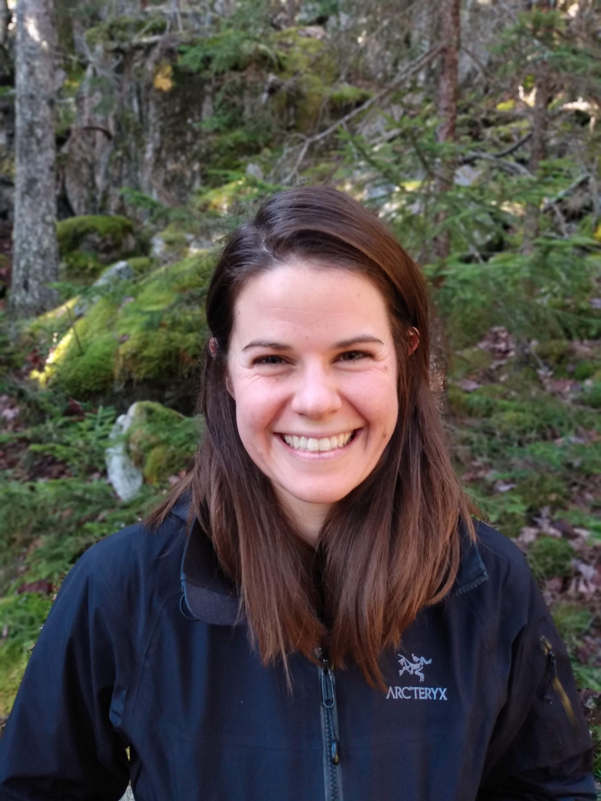

<link rel="stylesheet" href="styles.css" type="text/css">

**Meghan Blumstein**. Assistant Professor in Environmental Sciences and Architecture. Meghan has a joint appointment in the College and Graduate School of Arts and Sciences and the School of Architecture starting in August of 2024. Meghan received her BA from Middlebury College, where she studied dendroecology with her advisor Andrea Lloyd. She then completed her PhD at Harvard University in Organismal and Evolutionary Biology, working with plant physiologist Missy Holbrook and geneticist Robin Hopkins. She is currently a Bullard Fellow at the Harvard Forest and Postdoct affiliate at MIT and looking forward to joining the UVA faculty next year. 

 
 

## Postdocs

## Graduate Students and Techs

## Undergraduates

## Past Affiliates

* Miranda Osuego | Harvard Forest | Summer REU 2022 
* Haley Nakamura | MIT | 2022
* Theresa Caso-McHugh | MIT | 2020 - Present
* Sophie Webster | Harvard | 2020 – Present | Thesis: Are we underpredicting the urban heat island effect? 
* Nautica Jones | Harvard Forest | Summer REU 2021
* Andrew Castillo | Harvard | 2020 | Thesis: What is the role of STAMN2 in Alzheimer’s Disease?
* Aaron Viser | Harvard | 2016 – 2018
* Amy Zhou | Harvard | 2017
* Emma Borjigin-Wang | Harvard | 2016 – 2017 | Thesis: How does sugar storage relate to wood anatomy?
