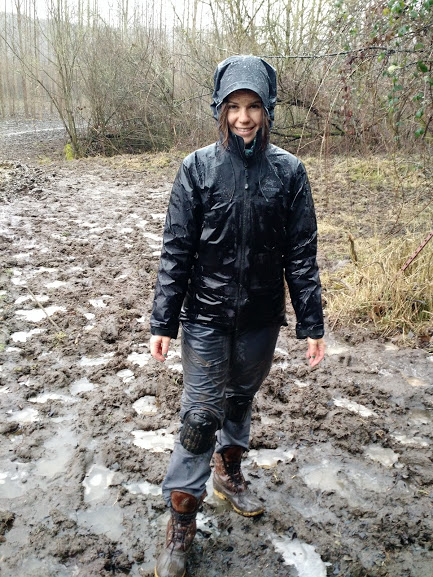

<link rel="stylesheet" href="styles.css" type="text/css">

**Select presentations**

* **Blumstein, M**. Can variation in sugar storage enable temperate trees to survive climate change? 2020. Environmental Science Seminar: MIT. Talk

* **Blumstein, M**., D. Weston, R. Hopkins, N.M. Holbrook. Resolving a hypothesized tradeoff between the active allocation of carbon to NSC storage versus other sink demands. 2020. ESA Annual Meeting. Talk

* Barker-Plotkin, A.A.B., **M. Blumstein**, D. Laflower, S. Kruszka, J. Elkinton, V. Pasquarella, B. Bradley, J.R. Thompson. Do defoliated oaks die from carbon starvation? 2020. ESA Annual Meeting.  Talk

* **Blumstein, M**., A.D. Richardson, D. Weston, J. Zhang, W. Muchero, and R. Hopkins. Current Biology. A new perspective on ecological prediction reveals limits to climate adaptation in a temperate tree species. 2020. Society of Comparative Biology (SICB), 2020. #15-2.Talk

* **Blumstein, M**., D. Weston, A. Richardson, R. Holbrook. A novel approach to quantifying the drivers of alternate carbon allocation strategies in a temperate, deciduous tree species. 2018. American Geophysical Union (AGU), Fall Meeting 2018, abstract #GC338-08. Talk

* **Blumstein, M**., R Hopkins, D J Weston, N M Holbrook, A D Richardson. Local adaptation of root sugar storage in black cottonwood (P. trichocarpa). Multiscale Plant Vascular Biology GRC. 2018. Mt. Snow, Vermont. Poster

