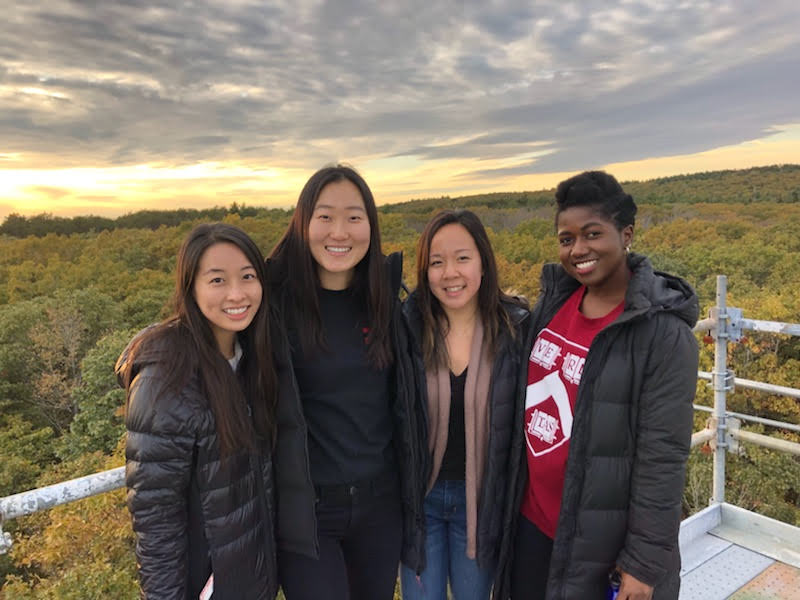
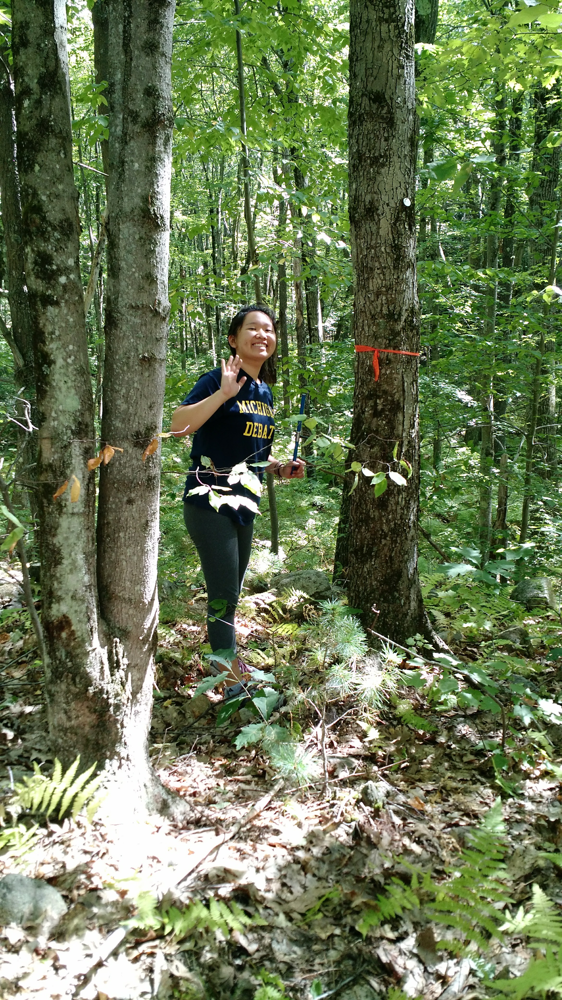

<link rel="stylesheet" href="styles.css" type="text/css">

### Mentoring 

* **In Lab Mentees**
Theresa Caso-McHugh | 2020 - Present
Andrew Castillo | 2020 – Present | Thesis: What is the role of STAMN2 in Alzheimer’s Disease?
Sophie Webster | 2020 – Present | Thesis: Are we underpredicting the urban heat island effect? Aaron Viser | 2016 – 2018
Amy Zhou | 2017
Emma Borjigin-Wang | 2016 – 2017 | Thesis: How does sugar storage relate to wood anatomy?

* **Resident Tutor** , Lowell House, Harvard University
  * From Fall 2017 through present I have been a resident tutor at Lowell House, one of the dorms at Harvard College. I live in the building with students where I am additional resource and daily interact with a wide range of students where I provide advice on both academic and personal matters. Within the house I am in charge of the intermural program, as well as part of the Fellowship team and the Lowell Speeches Program.

 

 

### Courses Taught 
R Programming Series
Harvard OEB REU program students
The Green Planet: Plants that Changed Human History
Harvard Extension School: ANTH E-1145
Ecology and the Design World
Harvard Graduate School of Design: SCI 6241
2019 & 2020 2019 2018 2018 2017 2010
Genetics and Genomics
Harvard College: OEB 50
Plant Biology
Harvard College: OEB 52
7th Grade Environmental Science 9th Grade Introductory Biology New Canaan Country School

* **R Programming Series for REU Students** (), Harvard OEB REU Program 2019 & 2020 (virtual)
  * I taught a 3-class (4 hours each) introductory bootcamp to R. The course covered the process of programming, basic syntax to get started, and effective problem-solving skills. 

* **The Green Planet: Plants that Changed Human History** (ANTH E-1145), Harvard Extension School | 2018 (virtual)
  * Description  

