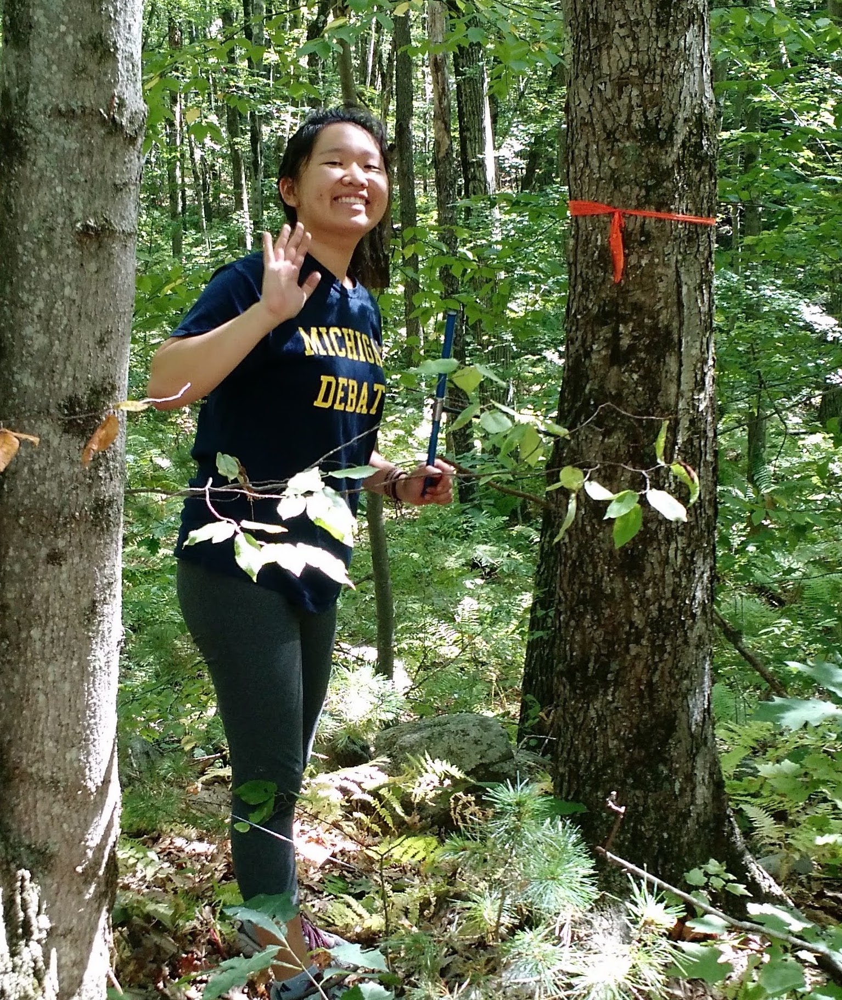
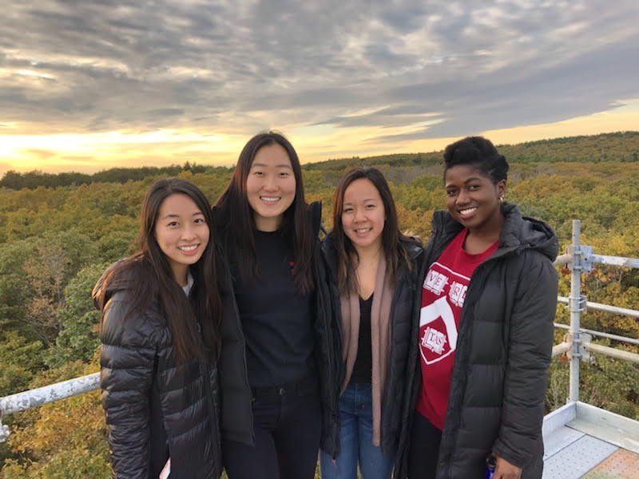
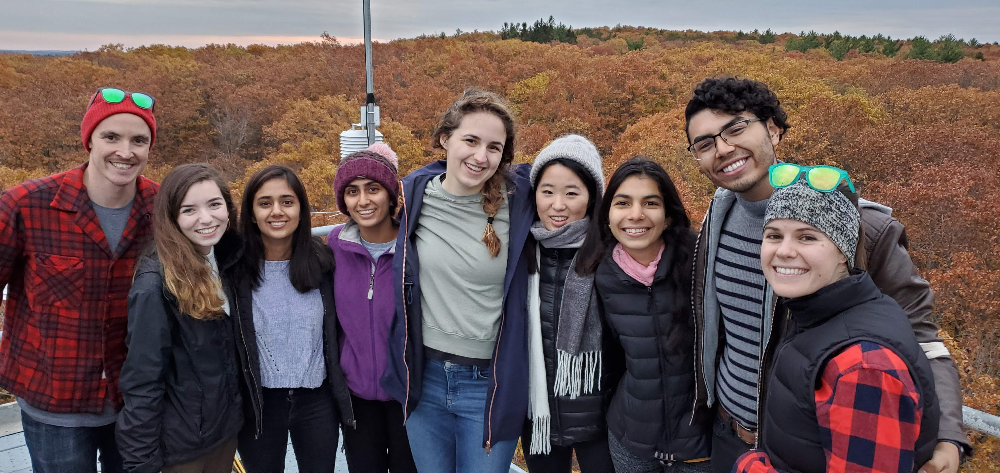

<link rel="stylesheet" href="styles.css" type="text/css">

### Mentoring 

**In Lab Mentees**

 

* Miranda Osuego | Summer REU 2022
* Haley Nakamura | 2022 - Present
* Theresa Caso-McHugh | 2020 - Present
* Sophie Webster | 2020 – Present | Thesis: Are we underpredicting the urban heat island effect? 
* Nautica Jones | Summer REU 2021
* Andrew Castillo | 2020 – Present | Thesis: What is the role of STAMN2 in Alzheimer’s Disease?
* Aaron Viser | 2016 – 2018
* Amy Zhou | 2017
* Emma Borjigin-Wang | 2016 – 2017 | Thesis: How does sugar storage relate to wood anatomy?

 
 
 
 

### Courses Taught 

** TREX**, MIT Civil and Environmental Engineering | 2022

* Environmental reserach fields methods courese taught on the Big Island of Hawaii. I helped lead student groups to learn about on-the-ground forest measurements techniques and analysis of drone aerial survey data

**Introduction to Climate Change**, MIT Civil and Environmental Engineering | 2021

* Provides an introduction to global climate change processes, drivers, and impacts. Offers exposure to exciting MIT research on climate change. Students explore why and how the world should solve this global problem and how they can contribute to the solutions. 

**R Programming Series for REU Students**, Harvard OEB REU Program | 2019 & 2020 (virtual)

* I developed and taught a 3-class (4 hours each) introductory bootcamp to R. The course covered the process of programming, basic syntax to get started, and effective problem-solving skills. 

**Proposal Writing and Peer Review Workshop**, Harvard Forest REU Program | 2018 & 2019

* I developed and led an evening workshop on how to craft clear and concise reserach proposals and how to conduct collegial and constructive peer review. 

**The Green Planet: Plants that Changed Human History** (ANTH E-1145), Harvard Extension School | 2018 (virtual)

* This course explores the role of several extraordinary plants in the emergence of complex societies, the shaping of global economies through time, and the development of modern science. While plants are featured in human history as a resource (shelter, fuel, fiber, food, or medicine) they also act as agents giving shape to our lives. Human-plant relations are fundamentally recursive; we explore the effects of these interactions as they pertain to the process of place-making. This course begins with an introduction to botany for social scientists and continues with a close reading of a selection of plants, including sugar cane, prosopis, gingko, and the potato. This course looks beyond how plants end up on our plates and challenges students to consider the broader impacts of human-plant relations.
  
**Genetics and Genomics** (OEB 50), Harvard College | 2018 

* Fundamental concepts in genetics and genomics forming a critical foundation for biology approached from two perspectives: (1) as a body of knowledge pertaining to genetic transmission, function, mutation, and evolution in eukaryotes and prokaryotes; and (2) as an experimental approach providing a toolkit for the study of biological processes such as development and behavior. Topics include structure, function, transmission, linkage, mutation, and manipulation of genes; genetic approaches in experimental studies of biological processes; and analysis of genomes in individuals and populations. Related ethical issues also discussed include genetically modified organisms, gene therapy, genetic testing, personalized medicine, and genetic privacy.

**Ecology and the Design World** (SCI 6241) Harvard Graduate School of Design | 2017

* The fundamentals of ecological science are introduced towards investigating, understanding, and shaping landscape structure, function and change. Through lectures, discussions, and readings, the core principles of ecological science relevant to designing landscapes from small to large scales are introduced and integrated, from populations to communities and ecosystems, and the landscape ecological linkages among sites.  Topics will include plant species reproduction and evolution, the relevance of biodiversity to landscape function and management, stresses facing designed landscapes, and the added values of ecological perspectives. We will discuss the particular problems and opportunities of urbanized landscapes, a dominant arena for modern landscape design work, as well as differences between natural and human-dominated landscapes. Disturbances, including climate change and sea level rise, intrude on ecological landscape design and these processes must be included into site planning.  

**Plant Biology**  (OEB 52), Harvard College | 2016

* Introduction to the structure, diversity, and physiology of plants with an emphasis on evolutionary relationships and adaptations to life on land. Topics include growth, resource acquisition, interactions with other organisms (i.e., fungi, bacteria, insects), reproduction, and survival in extreme environments. Laboratory sessions provide an overview of plant and diversity and an introduction to basic physiological processes.

